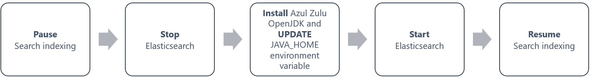
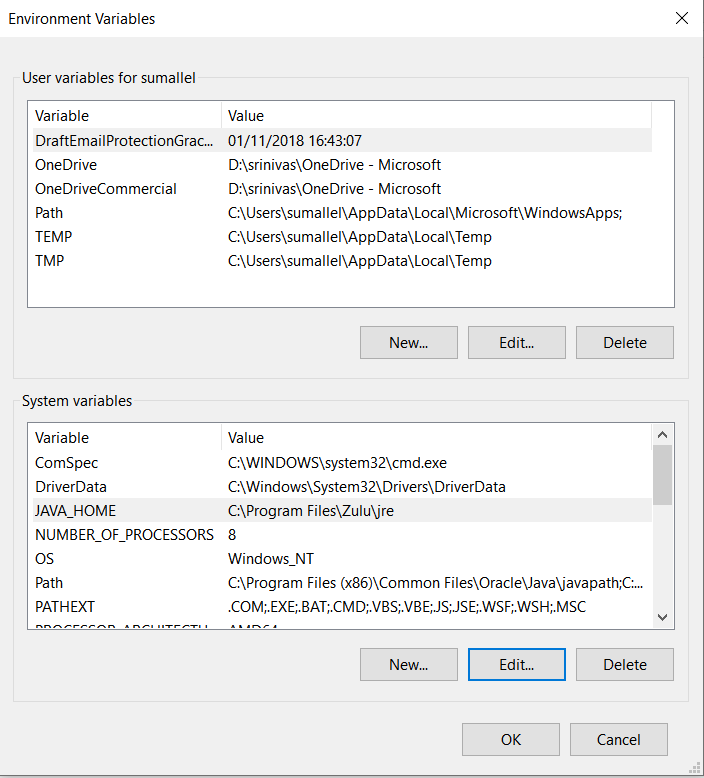

Below diagram explains the steps to migrate from Oracle JRE to Azul Zulu OpenJDK for Azure DevOps Server 2019.

## Step 1: Pause Search indexing
Go to https://github.com/Microsoft/Code-Search and find the right folder based on the Azure DevOps Server version you are using. In this case, go to [Azure_DevOps_Server_2019](../Azure_DevOps_Server_2019). To pause all indexing, execute the script PauseIndexing.ps1 from Windows PowerShell with administrative privileges on the machine where the SQL Server for Azure DevOps Server is running. You will be prompted to enter:

* The SQL server instance name where the TFS configuration database resides.
* The name of the TFS configuration database.

## Step 2: Stop Elasticsearch Service
Open Command Prompt as an administrator 

If Elasticsearch is installed on the same server as Azure DevOps Server (local installation), use below command to locate ES folder. For remote search installations, locate the ES installation path and change the directory accordingly.
### Change directory: 
cd "C:\Program Files\Azure DevOps Server 2019\Search\ES\elasticsearchv5\bin"
### Stop the service:
execute "elasticsearch-service.bat stop"

## Step 3: Download and Install Azul Zulu Java 
Download and install latest version of [OpenJDK 8](https://www.azul.com/downloads/zulu-community/?&version=java-8-lts&os=windows&os-details=Windows&architecture=x86-64-bit&package=jdk)

## Step 4: Update JAVA_HOME with Azul Zulu path

## Step 5: Start Elasticsearch Service
Open Command Prompt as an administrator 

If Elasticsearch is installed on the same server as Azure DevOps Server (local installation), use below command to locate ES folder. For remote search installations, locate the ES installation path and change the directory accordingly.
### Change directory: 
cd "C:\Program Files\Azure DevOps Server 2019\Search\ES\elasticsearchv5\bin"
### Start the service:
execute "elasticsearch-service.bat start"

## Step 6: Resume Search indexing
Go to https://github.com/Microsoft/Code-Search and find the right folder based on the Azure DevOps version you are using. In this case, go to [Azure_DevOps_Server_2019](../Azure_DevOps_Server_2019). Execute the script ResumeIndexing.ps1 with administrative privileges on the machine 
where the SQL Server for Azure DevOps Server is running to resume indexing again. You will be prompted to enter:

* The SQL server instance name where the Azure DevOps Server configuration database resides.
* The name of the TFS configuration database.
